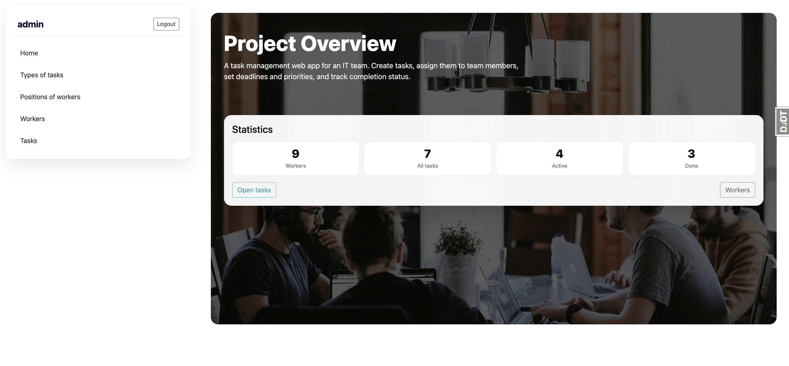
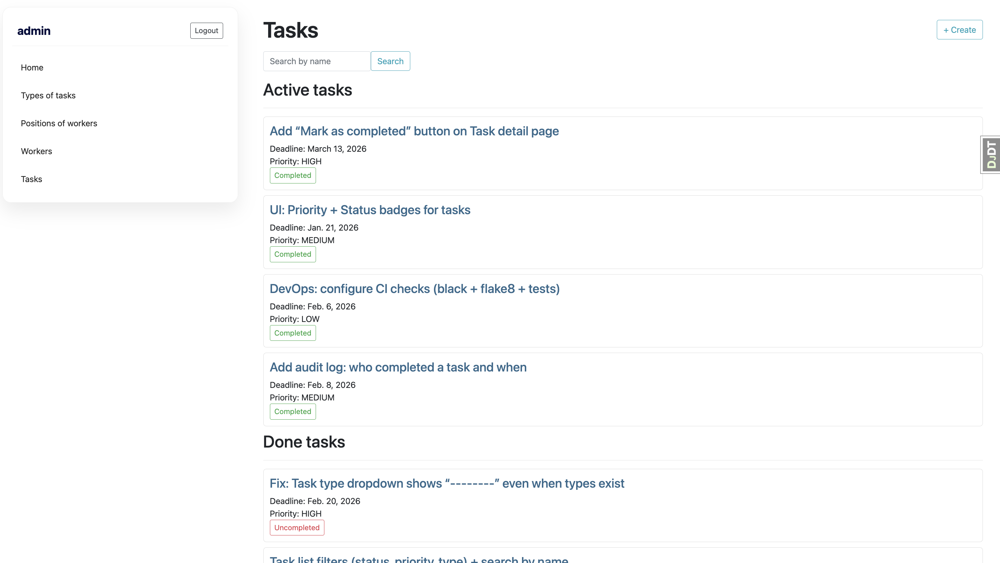
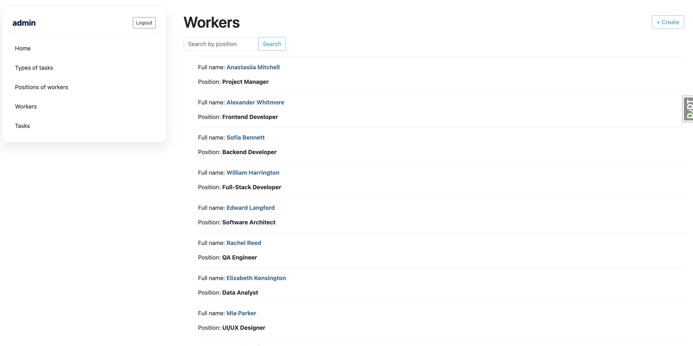

# IT Company Department Manager

A simple task management web app for an IT team.
It helps you organize work by creating tasks, assigning them to workers,
setting deadlines and priorities, and tracking completion status.
The project also includes basic management for workers, their positions
and task types, with a clean admin-style interface and search on list pages.

## Usage

**Home / Overview** - see project statistics.
**Workers** - manage employees and their positions.
**Tasks** - create tasks, set priority/deadline, and track status.

## Preview

### Overview



### Tasks



### Workers



## Run locally

```bash
python manage.py runserver
```

## Test user

login: alex
password: gpbUNw4Z.3HS!mt